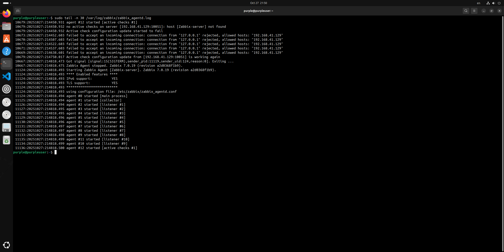

# Домашнее задание к занятию «Система мониторинга Zabbix»
---

### Задание 1 

Установите Zabbix Server с веб-интерфейсом.

#### Процесс выполнения
1. Выполняя ДЗ, сверяйтесь с процессом отражённым в записи лекции.
2. Установите PostgreSQL. Для установки достаточна та версия, что есть в системном репозитороии Debian 11.
3. Пользуясь конфигуратором команд с официального сайта, составьте набор команд для установки последней версии Zabbix с поддержкой PostgreSQL и Apache.
4. Выполните все необходимые команды для установки Zabbix Server и Zabbix Web Server.

#### Требования к результатам 
1. Прикрепите в файл README.md скриншот авторизации в админке.
2. Приложите в файл README.md текст использованных команд в GitHub.
---

# ОТВЕТ:

# Обновление пакетов
sudo apt update

# Установка PostgreSQL
sudo apt install -y postgresql postgresql-contrib

# Создание базы данных и пользователя для Zabbix
sudo -u postgres createuser --pwprompt zabbix
sudo -u postgres createdb -O zabbix zabbix

# Установка репозитория Zabbix для Ubuntu 24.04
wget https://repo.zabbix.com/zabbix/7.0/ubuntu/pool/main/z/zabbix-release/zabbix-release_7.0-1+ubuntu24.04_all.deb
sudo dpkg -i zabbix-release_7.0-1+ubuntu24.04_all.deb
sudo apt update

# Установка компонентов Zabbix
sudo apt install -y zabbix-server-pgsql zabbix-frontend-php zabbix-apache-conf zabbix-sql-scripts zabbix-agent

# Импорт начальной схемы базы данных
sudo zcat /usr/share/zabbix-sql-scripts/postgresql/server.sql.gz | sudo -u zabbix psql zabbix

# Настройка пароля БД в конфигурации Zabbix Server
sudo nano /etc/zabbix/zabbix_server.conf
# Добавлено: DBPassword=fuego2810

# Установка PHP модуля для PostgreSQL (потребовалось для веб-интерфейса)
sudo apt install -y php-pgsql

# Перезапуск и включение служб
sudo systemctl restart zabbix-server zabbix-agent apache2
sudo systemctl enable zabbix-server zabbix-agent apache2

# СКРИНШОТЫ:

# Авторизация в админке:

---

### Задание 2 

Установите Zabbix Agent на два хоста.

#### Процесс выполнения
1. Выполняя ДЗ, сверяйтесь с процессом отражённым в записи лекции.
2. Установите Zabbix Agent на 2 вирт.машины, одной из них может быть ваш Zabbix Server.
3. Добавьте Zabbix Server в список разрешенных серверов ваших Zabbix Agentов.
4. Добавьте Zabbix Agentов в раздел Configuration > Hosts вашего Zabbix Servera.
5. Проверьте, что в разделе Latest Data начали появляться данные с добавленных агентов.

#### Требования к результатам
1. Приложите в файл README.md скриншот раздела Configuration > Hosts, где видно, что агенты подключены к серверу
2. Приложите в файл README.md скриншот лога zabbix agent, где видно, что он работает с сервером
3. Приложите в файл README.md скриншот раздела Monitoring > Latest data для обоих хостов, где видны поступающие от агентов данные.
4. Приложите в файл README.md текст использованных команд в GitHub

---

# Использованные команды

# 1. Обновление системы на обеих ВМ
sudo apt update
sudo apt upgrade -y

# 2. Установка Zabbix Agent
sudo apt install zabbix-agent -y

# 3. Настройка конфигурации агента
sudo nano /etc/zabbix/zabbix_agentd.conf

# В конфиге:
# Server=<IP Zabbix Server>
# ServerActive=<IP Zabbix Server>
# Hostname=<имя хостa>

# 4. Перезапуск и включение агента
sudo systemctl restart zabbix-agent
sudo systemctl enable zabbix-agent
sudo systemctl status zabbix-agent

# 5. Проверка логов агента для подтверждения работы
sudo tail -n 30 /var/log/zabbix/zabbix_agentd.log

# ОТВЕТ:

# Скриншот Zabbix Web2:

##Скриншот Zabbix Web:

# Скриншот bashlog-tail:
 

